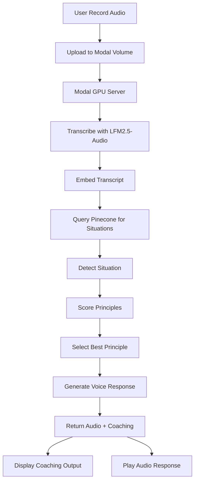
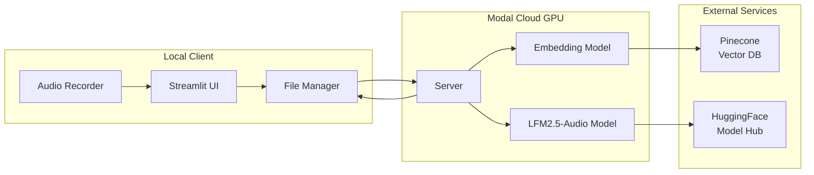
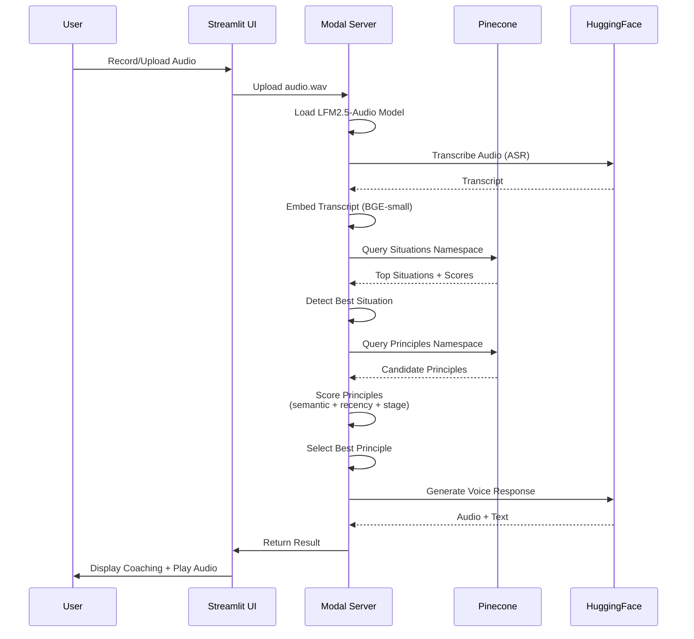
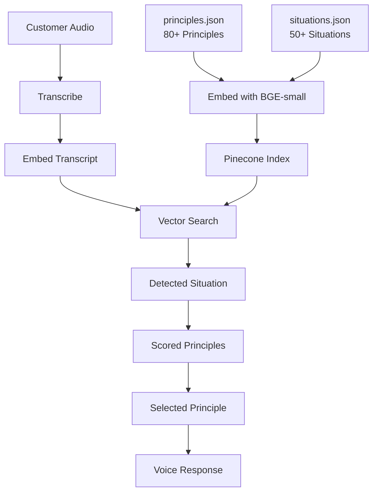

# 🎯 Behavioral Psychology Sales Coach

<div align="center">


**An AI-powered voice chatbot that coaches salespeople using behavioral psychology principles from Cialdini, Voss, and Kahneman.**

[Features](#-features) • [Architecture](#-architecture) • [Quick Start](#-quick-start) • [Documentation](#-documentation)

</div>

---

## 📖 Overview

The Behavioral Psychology Sales Coach listens to sales conversations in real-time, detects customer situations, and provides audio responses backed by evidence-based psychological principles. It combines:

- **Voice-to-Voice AI** powered by [LFM2.5-Audio](https://huggingface.co/LiquidAI/LFM2.5-Audio-1.5B)
- **Semantic Situation Detection** using Pinecone vector search
- **80+ Psychology Principles** from influential sales and psychology books
- **Real-time Coaching** with explainable AI decisions

### How It Works

1. **Record** customer audio from microphone or file upload
2. **Transcribe** using LFM2.5-Audio ASR
3. **Detect** the sales situation using semantic similarity
4. **Select** the best psychological principle using multi-factor scoring
5. **Generate** natural voice response with coaching explanation
6. **Display** structured coaching output explaining why this principle was chosen

---

## ✨ Features

### Phase I: End-to-End Pipeline ✅
- ✅ Real-time audio recording with silence detection
- ✅ Voice transcription using LFM2.5-Audio
- ✅ Situation detection (keyword matching)
- ✅ Principle selection from 80+ psychology principles
- ✅ Voice response generation
- ✅ Structured coaching output (YAML)
- ✅ Modal GPU deployment with model caching

### Phase II: Semantic Intelligence ✅
- ✅ **Semantic Detection**: Pinecone vector search replaces keyword matching
- ✅ **Multi-Factor Scoring**: Combines semantic relevance, recency penalty, stage fit, and randomization
- ✅ **Warm Pool**: Modal containers stay warm for sub-6s response times
- ✅ **Streamlit UI**: Web interface with microphone recording and file upload
- ✅ **Debug Panel**: Visualize situation detection and principle selection scores
- ✅ **Conversation Context**: Tracks turns, recent principles, and sales stage

### Coming in Phase III
- 🔄 Real-time coaching tips (~1.3s instead of ~6s)
- 🔄 Deep context tracking (customer profiles, stage progression)
- 🔄 Local Whisper for faster transcription (~0.5s)

---

## 🏗️ Architecture

### High-Level Flow



### Component Architecture



### Processing Pipeline



### Data Flow



---

## 🚀 Quick Start

### Prerequisites

- **Python 3.11+**
- **Modal Account** ([Sign up](https://modal.com) - free tier includes $30/month)
- **HuggingFace Account** ([Sign up](https://huggingface.co))
- **Pinecone Account** ([Sign up](https://app.pinecone.io) - free tier available)

### 1. Clone Repository

```bash
git clone <repository-url>
cd liquid-audio-model
```

### 2. Install Dependencies

```bash
# Create virtual environment
python -m venv venv
source venv/bin/activate  # On macOS/Linux
# or: venv\Scripts\activate  # On Windows

# Install package
pip install -e .

# Or with uv (faster)
uv sync
```

### 3. Configure Secrets

#### HuggingFace Token

1. Get token from [HuggingFace Settings](https://huggingface.co/settings/tokens)
2. Accept model terms: [LFM2.5-Audio-1.5B](https://huggingface.co/LiquidAI/LFM2.5-Audio-1.5B)
3. Create Modal secret:

```bash
modal secret create huggingface-secret HF_TOKEN=hf_your_token_here
```

#### Pinecone Setup

1. Create API key at [Pinecone Console](https://app.pinecone.io)
2. Create `.env` file:

```bash
cp .env.example .env
# Edit .env and add:
PINECONE_API_KEY=your_key_here
PINECONE_INDEX_NAME=sales-coach-embeddings
```

#### Modal Authentication

```bash
pip install modal
modal token new  # Opens browser for authentication
```

### 4. Populate Pinecone Index

```bash
python scripts/populate_pinecone.py
```

This embeds all situations and principles and uploads them to Pinecone (~2 minutes).

### 5. Deploy to Modal

```bash
modal deploy src/server.py
```

### 6. Run Streamlit App

```bash
streamlit run streamlit_app/app.py
```

Open [http://localhost:8501](http://localhost:8501) in your browser.

---

## 📚 Documentation

### Project Structure

```
liquid-audio-model/
├── README.md                    # This file
├── PROJECT_PLAN.md              # Master project plan with all phases
├── PHASE1_IMPLEMENTATION.md     # Phase 1 implementation details
├── PHASE2_IMPLEMENTATION.md     # Phase 2 implementation details
├── PHASE3_IMPLEMENTATION.md     # Phase 3 (current focus)
│
├── pyproject.toml               # Python dependencies
├── .env.example                 # Environment variables template
├── .gitignore                   # Git ignore rules
│
├── principles.json              # 80+ psychology principles
├── situations.json              # 50+ sales situations
│
├── src/                         # Source code
│   ├── __init__.py
│   │
│   ├── # Core Logic
│   ├── detector.py              # Situation detection (semantic + keyword)
│   ├── selector.py              # Principle selection
│   ├── formatter.py             # Coaching output formatting
│   ├── context.py               # Conversation context tracking
│   ├── principle_scorer.py      # Multi-factor scoring
│   │
│   ├── # Semantic Matching
│   ├── embeddings.py            # BGE-small-en-v1.5 embeddings
│   ├── pinecone_client.py       # Pinecone vector operations
│   │
│   ├── # Audio Processing
│   ├── audio_recorder.py        # Microphone recording
│   ├── audio_player.py          # Audio playback
│   ├── file_manager.py          # Modal volume operations
│   │
│   ├── # Infrastructure
│   ├── modal_app.py             # Modal configuration
│   ├── server.py                # Modal server (GPU)
│   └── client.py                # CLI client (optional)
│
├── streamlit_app/               # Web UI
│   ├── app.py                   # Main Streamlit app
│   └── components/
│       └── debug_panel.py       # Debug visualization
│
└── scripts/
    └── populate_pinecone.py     # Pinecone index population
```

### Key Components

#### Situation Detection

**Phase I**: Simple keyword matching against `situations.json`

**Phase II**: Semantic similarity search using Pinecone:
- Embed customer transcript with BGE-small-en-v1.5
- Query Pinecone `situations` namespace
- Return top matching situations with confidence scores

```python
from src.detector import detect_situation_semantic

situation = detect_situation_semantic(
    transcript="That's too expensive, I saw it cheaper on Amazon",
    pinecone_client=pc_client,
    embedding_model=embed_model
)
# Returns: DetectedSituation with situation_id, confidence_score, etc.
```

#### Principle Selection

**Phase I**: First-match selection from applicable principles

**Phase II**: Multi-factor scoring:
- **Semantic Relevance (40%)**: Cosine similarity to transcript
- **Recency Penalty (30%)**: Avoids repeating recently used principles
- **Stage Fit (20%)**: Bonus for principles matching current sales stage
- **Random Variation (10%)**: Prevents deterministic selection

```python
from src.selector import select_principle_semantic

principle = select_principle_semantic(
    situation=situation,
    context=conversation_context,
    pinecone_client=pc_client,
    embedding_model=embed_model,
    principles_dict=principles
)
# Returns: SelectedPrinciple with selection_score breakdown
```

#### Response Generation

Uses LFM2.5-Audio with principle details in system prompt:

```python
system_prompt = f"""
You are a helpful sales assistant. Respond using:

PRINCIPLE: {principle.name}
DEFINITION: {principle.definition}
APPROACH: {principle.intervention}
EXAMPLE: {principle.example_response}

Respond naturally and conversationally (2-3 sentences).
Respond with interleaved text and audio.
"""
```

### Phase Details

| Phase | Status | Key Features | Time to Coaching |
|-------|--------|--------------|------------------|
| **Phase I** | ✅ Complete | Keyword detection, first-match selection, CLI | ~6s |
| **Phase II** | ✅ Complete | Semantic detection, multi-factor scoring, Streamlit UI | ~6s |
| **Phase III** | 🔄 In Progress | Real-time tips (~1.3s), deep context, local Whisper | ~1.3s (goal) |

See [PROJECT_PLAN.md](PROJECT_PLAN.md) for detailed phase breakdown.

---

## 💡 Usage Examples

### Streamlit Web UI

1. Start the app: `streamlit run streamlit_app/app.py`
2. **Record audio**: Click microphone button and speak
3. **Or upload file**: Use file uploader for pre-recorded audio
4. View **coaching output** with principle explanation
5. Listen to **voice response**
6. Check **debug panel** for detection scores

### CLI Client (Optional)

```bash
modal run src/client.py
```

Interactive conversation loop:
- Records from microphone
- Uploads to Modal
- Displays coaching YAML
- Plays audio response

---

## 🔧 Configuration

### Modal Settings

**Warm Pool Configuration** (in `src/server.py`):

```python
@app.cls(
    image=image,
    gpu="L40S",
    min_containers=1,      # Keep 1 container warm
    buffer_containers=1,   # Extra buffer when active
    scaledown_window=300,  # 5 min idle before scale down
)
```

**Cost**: ~$1.50-2.00/hour for warm L40S container

### Scoring Weights

Adjust in `src/principle_scorer.py`:

```python
WEIGHTS = {
    "semantic": 0.4,    # Cosine similarity
    "recency": 0.3,     # Negative weight for recent use
    "stage": 0.2,       # Bonus for stage match
    "random": 0.1       # Variation factor
}
```

### Pinecone Settings

**Index Configuration**:
- Dimension: 384 (BGE-small-en-v1.5)
- Namespaces: `situations`, `principles`
- Metric: Cosine similarity

---

## 🐛 Troubleshooting

### "No microphone access"
- **macOS**: System Preferences > Security & Privacy > Privacy > Microphone
- Grant access to Terminal/VS Code/Python

### "Modal authentication failed"
```bash
modal token new  # Re-authenticate
```

### "HuggingFace model access denied"
1. Accept model terms: [LFM2.5-Audio-1.5B](https://huggingface.co/LiquidAI/LFM2.5-Audio-1.5B)
2. Verify token has "Read" access
3. Recreate Modal secret: `modal secret create huggingface-secret HF_TOKEN=hf_new_token`

### "Pinecone index not found"
```bash
python scripts/populate_pinecone.py  # Re-populate index
```

### "Empty transcript"
- Check audio quality
- Ensure microphone is working
- Try speaking louder or closer to mic

### Model loading slow (first request)
- This is normal - model loads on first request (~15-30s)
- Subsequent requests use warm pool and are faster (~3-6s)

---

## 📊 Data Assets

### principles.json

~80+ behavioral psychology principles from:
- **Cialdini's "Influence: The Psychology of Persuasion"**
- **Voss's "Never Split the Difference"**
- **Kahneman's "Thinking, Fast and Slow"**

Each principle includes:
- Definition and mechanism
- Intervention strategy
- Example response
- Source citation (book, chapter, page)

### situations.json

~50+ sales situations with:
- Signals (what customer says)
- Contra-signals (opposite indicators)
- Applicable principles
- Typical sales stage
- Priority level

Examples:
- `price_shock_in_store`
- `online_price_checking`
- `just_browsing`
- `need_to_check_with_family`
- `fear_of_wrong_choice`

---

## 🔮 Roadmap

### Phase III (In Progress)
- [ ] Real-time coaching tips (~1.3s)
- [ ] Quick tip lookup from situations
- [ ] Server-Sent Events (SSE) streaming
- [ ] Deep context tracking
- [ ] Customer profile extraction
- [ ] Stage progression detection
- [ ] Local Whisper integration (~0.5s transcription)

### Future Considerations
- Voice tone analysis (frustration, excitement)
- Streaming audio playback
- A/B testing different principles
- Outcome tracking (did tip help close?)
- Team analytics dashboard
- Multi-language support

---

## 🤝 Contributing

This is a research project. Contributions welcome! Areas of interest:

1. **New Principles**: Add psychology principles from additional sources
2. **New Situations**: Expand situation detection coverage
3. **Better Scoring**: Improve principle selection algorithms
4. **Performance**: Optimize for faster response times
5. **UI/UX**: Enhance Streamlit interface

---

## 📄 License

MIT License - see LICENSE file for details

---

## 🙏 Acknowledgments

- **Liquid AI** for [LFM2.5-Audio](https://huggingface.co/LiquidAI/LFM2.5-Audio-1.5B) model
- **Modal** for serverless GPU infrastructure
- **Pinecone** for vector database
- **HuggingFace** for model hosting and sentence transformers

---

## 📞 Support

- **Issues**: Open an issue on GitHub
- **Documentation**: See `PROJECT_PLAN.md` for detailed architecture
- **Phase Details**: Check `PHASE1_IMPLEMENTATION.md` and `PHASE2_IMPLEMENTATION.md`

---

<div align="center">

**Built with ❤️ using behavioral psychology and AI**

[⬆ Back to Top](#-behavioral-psychology-sales-coach)

</div>
